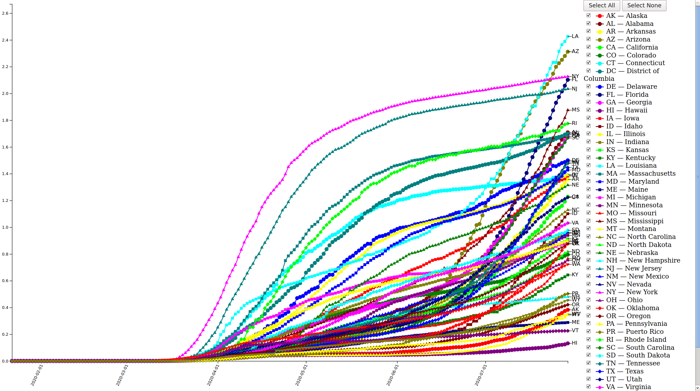

# COVID-19 derivative graphs

Code to generate derivative graphs from the wonderful [JHU data], which is also
on GitHub. Currently, this code can make:

* An HTML page with a graph of total confirmed per-capita COVID-19 cases per
  state, per day. (Example featured above.)
* gnuplot graph of total confirmed per-capita COVID-19 cases per state, per
  day.
* gnuplot graph of daily confirmed per-capita COVID-19 cases per state, per
  day.

This data is also available on the [JHU dashboard], however, I found it hard to
compare state-to-state: you can only see one state at a time, and the numbers
are absolute, not per-capita.

## Running the code

1. Clone the JHU data into `COVID-19`, at the root of this repository:

	   make clone-jhu

   If you've already cloned, you can update the repository:

       make update-jhu

2. Build the graphs:

       make gnuplot html

3. There should now be a `page.html`; just open this in a modern browser. A
   screenshot of this page is at the top of this `README`.

   The gnuplot graphs it generates are in `plot.svg` (total per-capita
   confirmed cases) and `per-day-change.svg` (per-day per-capita confirmed
   cases)

[JHU data]: https://github.com/CSSEGISandData/COVID-19
[JHU dashboard]: https://gisanddata.maps.arcgis.com/apps/opsdashboard/index.html#/bda7594740fd40299423467b48e9ecf6
